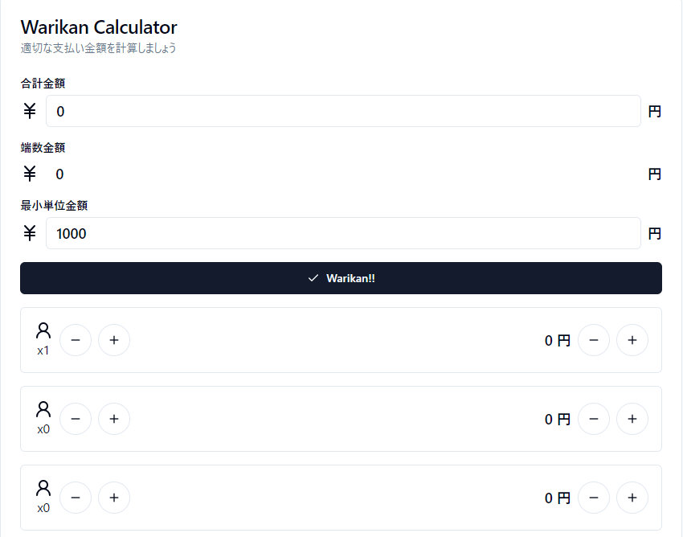

# Warikan Calculator

傾斜付き割り勘を計算します



## 基本的な使い方 (傾斜なし)

1. 「合計金額」を入力
2. 左側の-+ボタンで人数を調整
3. 「Warikan!!」ボタンをクリック
4. 端数金額を見つつ、右側の-+ボタンで金額調整

## 傾斜あり

0. 事前に以下のプログラムで傾斜に対応する圧縮文字列を計算しておきます
1. ページの下の方にあるテキストエリアに圧縮文字列をペースト
2. 「Load Keisha!!」ボタンをクリック
3. 以下、傾斜なしと同じ (傾斜なしの1.から順に実行)

```ts
import pkg from "lz-string";
const { compressToBase64 } = pkg;

const keisha = [
    {
        name: "role1",
        keisha: 1.2,
    },
    {
       name: "role2",
       keisha: 1.0,
    }
]

console.log(compressToBase64(JSON.stringify(keisha)));
```

keisha パラメータは name 間で比率が同じであれば、計算結果は同じです。すなわち、上で提示したコードと以下のコードは同じ動作をします。

```ts
const keisha = [
    {
        name: "role1",
        keisha: 12,
    },
    {
       name: "role2",
       keisha: 10,
    }
]
```
