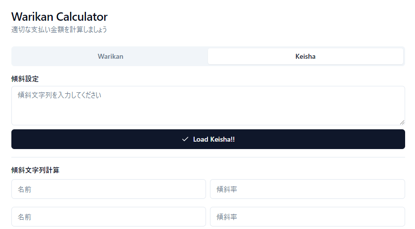

# Warikan Calculator

傾斜付き割り勘を計算します

https://kaiiy.github.io/warikan/

## 使い方

### 傾斜なし

1. 「合計金額」を入力
2. (オプション) 「最小単位金額」を入力
3. 左側の-+ボタンで人数を調整
4. 「Warikan!!」ボタンをクリック
5. 端数金額を見つつ、右側の-+ボタンで金額調整

### 傾斜あり

0. 「名前」「傾斜率」を入力
1. 「Calculate Keisha!!」ボタンをクリック
3. 「Load Keisha!!」ボタンをクリック
4. 以下、傾斜なしと同じ (傾斜なしの1.から順に実行)

> [!TIP]
> 「傾斜文字列」を保存しておくと、次回以降の入力を省略できます
> 「傾斜文字列」は、「名前」「傾斜率」のロスレス圧縮文字列です
>
> 使い方: 「傾斜文字列」を「傾斜設定」にペーストし、「Load Keisha!!」ボタンをクリック
